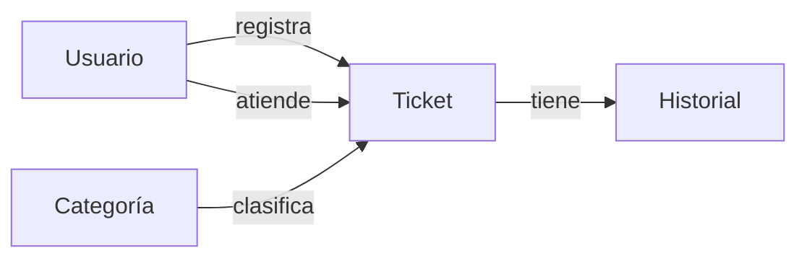
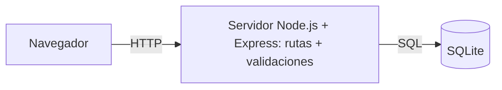

# H1 — Inicio y planificación

**Fecha programada:** 29-09 · **Fecha real de ejecución:** 30-09 (inicio tardío, ver §9)

**Roles en este hito:** Líder de Proyecto y Control: Cristóbal Chacón · Solución y Desarrollo: Milton Zambrano · Datos, Calidad y Pruebas: Cristóbal Chacón

## 1. Problema

La organización recibe los requerimientos de soporte TI por correo, mensajería y conversaciones informales.
No existe un registro único, por lo que:

- no se sabe quién es responsable de cada solicitud;
- no hay prioridad explícita y se atiende "al que reclama más";
- no se conoce el estado de una solicitud ni cuánto tardó en resolverse;
- las solicitudes se pierden o se duplican y no hay datos para mejorar el servicio.

## 2. Objetivo

**Objetivo general:** construir, al 13-10, un MVP web que permita registrar una solicitud de soporte y
seguirla hasta su cierre, con persistencia en una base de datos relacional y trazabilidad de responsable,
prioridad, estado y fechas.

**Objetivos específicos**
1. Centralizar el registro de solicitudes en un único sistema con identificador único y fecha.
2. Permitir asignar responsable y actualizar el estado según un flujo definido.
3. Consultar y filtrar solicitudes y ver un resumen por estado.
4. Gestionar el proyecto con tablero, repositorio y reportes de avance trazables.

## 3. Alcance v0.1

| Incluye | No incluye (fuera de alcance) |
|---|---|
| Registro de solicitudes (solicitante, título, descripción, categoría, prioridad) | Login con contraseña y gestión de permisos |
| Identificador único y fecha de creación automáticos | Notificaciones por correo o mensajería |
| Listado con estado, prioridad y responsable | Adjuntar archivos o capturas |
| Asignación de responsable y cambio de estado | Cálculo automático de SLA / alertas de vencimiento |
| Filtros por estado, prioridad y categoría | Aplicación móvil |
| Resumen: total y cantidad por estado | Integración con correo o Active Directory |
| Historial de cambios relevantes | Despliegue en la nube / producción |
| Base de datos relacional con usuarios, categorías, tickets e historial | Reportes gráficos avanzados |

## 4. Historias de usuario

| ID | Historia | Requisito |
|---|---|---|
| HU-01 | Como **solicitante**, quiero registrar una solicitud con título, descripción, categoría y prioridad, para que TI conozca mi problema. | RF-01 |
| HU-02 | Como **solicitante**, quiero recibir un número de ticket al registrar, para poder hacer seguimiento. | RF-02 |
| HU-03 | Como **técnico**, quiero ver la lista de solicitudes con su estado, prioridad y responsable, para organizar mi trabajo. | RF-03 |
| HU-04 | Como **coordinador de TI**, quiero asignar un responsable a una solicitud, para que alguien se haga cargo. | RF-04 |
| HU-05 | Como **técnico**, quiero cambiar el estado de una solicitud (Nuevo, En proceso, Resuelto, Cerrado), para reflejar su avance. | RF-04 |
| HU-06 | Como **técnico**, quiero filtrar solicitudes por estado, prioridad o categoría, para encontrar rápido lo urgente. | RF-05 |
| HU-07 | Como **coordinador de TI**, quiero ver el total de solicitudes y cuántas hay en cada estado, para conocer la carga del equipo. | RF-06 |
| HU-08 | Como **coordinador de TI**, quiero que quede registro de quién cambió el estado o el responsable y cuándo, para tener trazabilidad. | BD-01 |
| HU-09 | Como **usuario**, quiero que el sistema me avise si dejé campos obligatorios vacíos, para no registrar solicitudes incompletas. | CAL-01 |

## 5. Equipo y roles asignados

El enunciado plantea equipos de 3 integrantes; **este equipo tiene 2**. Se mantiene la regla de que cada integrante
ejerce los tres roles al menos una vez: en cada hito una persona asume dos roles y se alternan.

| Fecha | Líder de Proyecto y Control | Solución y Desarrollo | Datos, Calidad y Pruebas |
|---|---|---|---|
| H1 (29-09, ejecutado 30-09) | Cristóbal Chacón | Milton Zambrano | Cristóbal Chacón |
| H2 (30-09) | Milton Zambrano | Cristóbal Chacón | Milton Zambrano |
| H3 (06-10) | Cristóbal Chacón | Milton Zambrano | Cristóbal Chacón |
| H4 (07-10) | Integración conjunta | Integración conjunta | Integración conjunta |

Resultado: al cierre de H2 ambos integrantes ya ejercieron los tres roles.

## 6. Cronograma preliminar

| Fecha | Hito | Entregable principal |
|---|---|---|
| 29-09 → 30-09 | H1 Inicio | Alcance v0.1, historias, tablero y repo |
| 30-09 | H2 Línea base | Planificación v1.0, ER + script, wireframes |
| 06-10 | H3 MVP v0.1 | RF-01 a RF-04 funcionando + Reporte N.º 1 |
| 07-10 | H4 Integración | RF-05/06, QA, cambio + Reporte N.º 2 |
| 13-10 | Final | MVP v1.0, informe, presentación |

## 7. Modelo de datos conceptual

- **Usuario**: persona que solicita o atiende (solicitante, técnico o administrador).
- **Categoría**: tipo de solicitud (Hardware, Software, Red, Accesos, Impresoras, Otro).
- **Ticket**: la solicitud de soporte.
- **Historial**: registro de cada cambio relevante de un ticket.

Relaciones:
- Un usuario **registra** muchos tickets (como solicitante).
- Un usuario **atiende** muchos tickets (como responsable); un ticket puede no tener responsable aún.
- Una categoría **clasifica** muchos tickets.
- Un ticket **tiene** muchos registros de historial.

## 8. Boceto inicial de arquitectura e interfaz

Pantallas previstas: **Listado de solicitudes** (inicio), **Nueva solicitud**, **Detalle / actualizar**.
Los wireframes detallados se entregan en H2.

## 9. Imprevisto registrado: inicio tardío y equipo de 2

| | |
|---|---|
| **Qué pasó** | El equipo no alcanzó a iniciar el 29-09. Además, el equipo quedó conformado por 2 integrantes en vez de 3. |
| **Impacto** | H1 y H2 deben ejecutarse el mismo día (30-09). Cada integrante asume más horas (~59 h en vez de ~39 h). |
| **Acción** | Se consolidan H1 y H2 el 30-09; se adapta la rotación de roles a 2 personas; se prioriza con MoSCoW para proteger los requisitos *Must*. |
| **Registro en tablero** | Tarjeta "Inicio tardío / equipo de 2" en columna Bloqueado → Hecho. |

## 10. Evidencia del hito

- [ ] Captura del tablero con fecha → `docs/evidencias/H1_tablero.png`
- [ ] Enlace al repositorio
- [x] Minuta del hito (abajo)

---

## Minuta H1 — 30-09

| | |
|---|---|
| **Asistentes** | Cristóbal Chacón (Líder, Datos/QA), Milton Zambrano (Desarrollo) |
| **Objetivo** | Iniciar el proyecto y dejar definida la planificación inicial |

**Temas tratados**
1. Lectura del enunciado y definición del problema y objetivo.
2. Definición del alcance v0.1 (incluye / no incluye).
3. Redacción de 9 historias de usuario asociadas a RF-01..RF-06, BD-01 y CAL-01.
4. Elección de herramientas: GitHub (repositorio) y GitHub Projects (tablero).
5. Elección tecnológica: Node.js + Express + SQLite (ver justificación en H2).
6. Adaptación de la rotación de roles a 2 integrantes.

**Acuerdos**

| # | Acuerdo | Responsable | Fecha |
|---|---|---|---|
| 1 | Crear repositorio y agregar colaborador | Cristóbal Chacón | 30-09 |
| 2 | Crear tablero con columnas mínimas y backlog inicial | Cristóbal Chacón | 30-09 |
| 3 | Proponer modelo de datos conceptual | Cristóbal Chacón | 30-09 |
| 4 | Preparar línea base (ER, EDT, costos, wireframes) para H2 | Equipo | 30-09 |

**Traspaso a H2 (Líder: Cristóbal → Milton; Desarrollo: Milton → Cristóbal; Datos/QA: Cristóbal → Milton)**
- **Terminado:** alcance v0.1, historias, repo, tablero, modelo conceptual.
- **En curso:** cronograma detallado y estimaciones.
- **Bloqueado:** nada.
- **Evidencia:** captura del tablero, enlace repo, este documento.
- **Decisión a continuar:** pasar el modelo conceptual a diagrama ER y script SQL.
