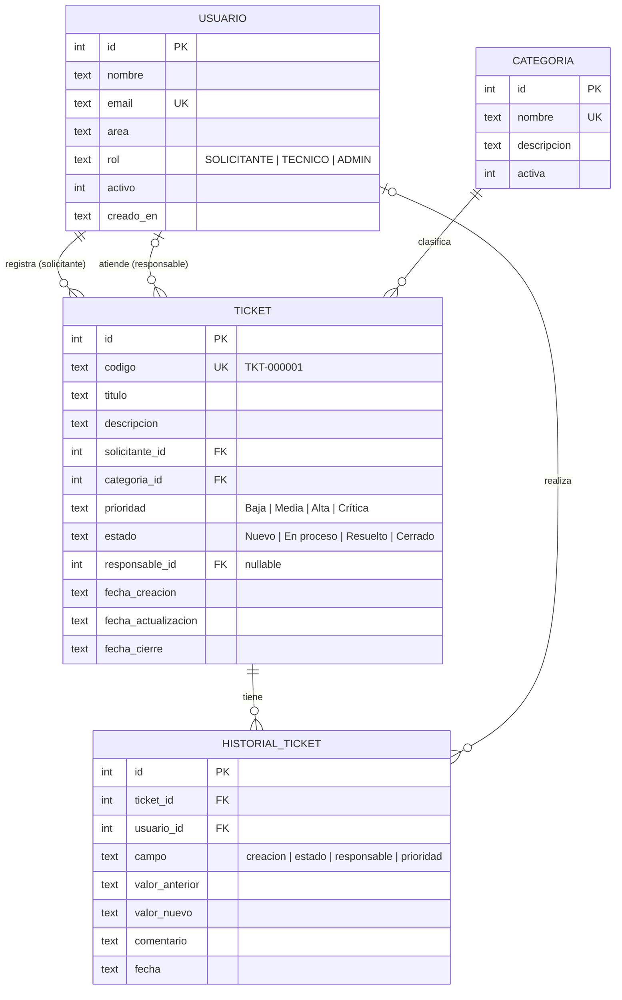
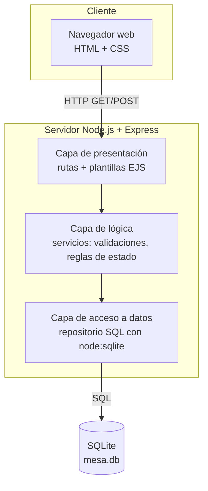
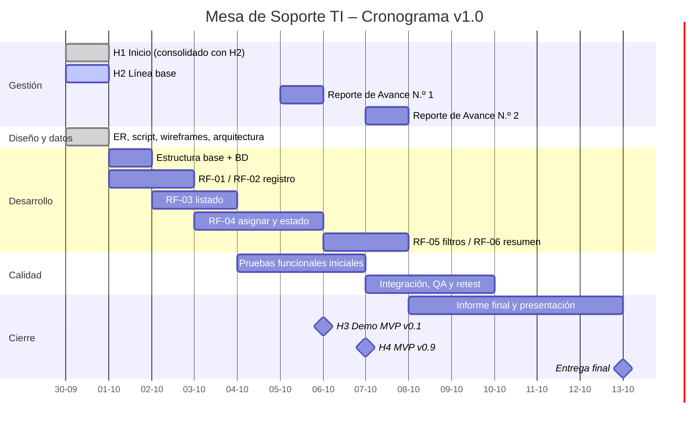

# H2 · 30-09 — Línea base del proyecto (Planificación v1.0)

**Roles en este hito:** Líder de Proyecto y Control: Milton Zambrano · Solución y Desarrollo: Cristóbal Chacón · Datos, Calidad y Pruebas: Milton Zambrano

> Este documento congela la **línea base**: todo cambio posterior de alcance, plazo o costo se registra
> como cambio controlado (tarjeta en el tablero + nota en el Reporte de Avance).

---

## 1. Alcance v1.0

### 1.1 Requisitos y criterios de aceptación

| ID | Requisito | Prioridad | Criterio de aceptación |
|---|---|---|---|
| RF-01 | Registrar solicitud con solicitante, título, descripción, categoría y prioridad | Must | Al enviar el formulario completo, el ticket queda guardado en la BD con estado "Nuevo" y aparece en el listado. |
| RF-02 | Identificador único y fecha de creación | Must | Cada ticket recibe un código `TKT-000001` irrepetible y la fecha/hora de creación automática; el usuario no puede editarlos. |
| RF-03 | Listar solicitudes con estado, prioridad y responsable | Must | El listado muestra código, título, categoría, prioridad, estado, responsable ("Sin asignar" si no hay) y fecha, ordenado del más nuevo al más antiguo. |
| RF-04 | Actualizar responsable y estado | Must | Se puede asignar un técnico y cambiar el estado respetando el flujo (ver 1.2); cada cambio queda en el historial con fecha. |
| RF-05 | Filtrar por estado, prioridad o categoría | Should | Al elegir uno o más filtros, el listado muestra solo los tickets que cumplen todos; "Limpiar" vuelve al listado completo. |
| RF-06 | Resumen: total y cantidad por estado | Should | Sobre el listado se muestra el total y la cantidad en Nuevo / En proceso / Resuelto / Cerrado, coincidiendo con la BD. |
| BD-01 | Persistencia de usuarios, tickets, categorías y cambios | Must | Los datos siguen disponibles tras reiniciar la aplicación; existe tabla de historial. |
| CAL-01 | Validaciones, manejo de errores y evidencia de pruebas | Must | Campos obligatorios validados en servidor; errores muestran mensaje amigable (sin traza técnica); matriz de pruebas ejecutada. |

### 1.2 Reglas de negocio

- **Flujo de estados:** `Nuevo → En proceso → Resuelto → Cerrado`. Se permite `Resuelto → En proceso` (reapertura). `Cerrado` es final.
- No se puede pasar a "En proceso" sin responsable asignado.
- Al cerrar se guarda `fecha_cierre`.
- Prioridades: Baja, Media, Alta, Crítica.
- Título: 5–120 caracteres. Descripción: mínimo 10 caracteres.

### 1.3 Fuera de alcance (se mantiene de v0.1)

Login con contraseña, notificaciones, adjuntos, SLA automáticos, app móvil, integración con correo, despliegue en la nube.
El "usuario actual" se selecciona desde una lista en la interfaz (simplificación del MVP).

---

## 2. Backlog priorizado

Priorización **MoSCoW** (Must / Should / Could / Won't). El detalle completo con fechas y estimaciones está en
[`backlog.csv`](backlog.csv) y en el tablero.

| # | ID | Tarea | Prioridad | Est. (h) | Hito |
|---|---|---|---|---|---|
| 1 | T-01 | Crear repositorio, README y colaboradores | Must | 1 | H1 |
| 2 | T-02 | Crear tablero y backlog inicial | Must | 2 | H1 |
| 3 | T-03 | Definir problema, objetivo, alcance e historias | Must | 4 | H1 |
| 4 | T-04 | Modelo de datos conceptual | Must | 2 | H1 |
| 5 | T-05 | Alcance v1.0, EDT y cronograma | Must | 4 | H2 |
| 6 | T-06 | Estimación de horas, recursos y costos | Must | 3 | H2 |
| 7 | T-07 | Diagrama ER y script `schema.sql` + `seed.sql` | Must | 4 | H2 |
| 8 | T-08 | Wireframes de pantallas | Must | 4 | H2 |
| 9 | T-09 | Arquitectura preliminar | Must | 3 | H2 |
| 10 | T-10 | Plan de pruebas inicial | Must | 3 | H2 |
| 11 | T-11 | Estructura base Express + conexión a SQLite | Must | 3 | H3 |
| 12 | T-12 | RF-01/RF-02: formulario y registro de ticket | Must | 6 | H3 |
| 13 | T-13 | RF-03: listado de tickets | Must | 4 | H3 |
| 14 | T-14 | RF-04: asignar responsable, cambiar estado e historial | Must | 6 | H3 |
| 15 | T-15 | Validaciones y manejo de errores (CAL-01) | Must | 4 | H3 |
| 16 | T-16 | Pruebas funcionales iniciales + registro de defectos | Must | 5 | H3 |
| 17 | T-17 | Reporte de Avance N.º 1 | Must | 2 | H3 |
| 18 | T-18 | RF-05: filtros | Should | 4 | H4 |
| 19 | T-19 | RF-06: resumen por estado | Should | 3 | H4 |
| 20 | T-20 | Pruebas de integración, retest y análisis de cambio | Must | 7 | H4 |
| 21 | T-21 | Reporte de Avance N.º 2 | Must | 2 | H4 |
| 22 | T-22 | Informe final, presentación y demo | Must | 18 | Final |
| — | T-23 | Estilos visuales mejorados / exportar a CSV | Could | 4 | Si sobra tiempo |
| — | T-24 | Login con contraseña | Won't | — | Fuera de alcance |

---

## 3. Estructura de Desglose del Trabajo (EDT)

```mermaid
flowchart TD
    P[Mesa de Soporte TI] --> G[1 Gestión del proyecto]
    P --> A[2 Análisis y diseño]
    P --> D[3 Datos]
    P --> S[4 Desarrollo]
    P --> Q[5 Calidad y pruebas]
    P --> C[6 Cierre]
    G --> G1[1.1 Plan y alcance]
    G --> G2[1.2 Tablero y backlog]
    G --> G3[1.3 Reportes de avance]
    G --> G4[1.4 Riesgos y cambios]
    G --> G5[1.5 Minutas y traspasos]
    A --> A1[2.1 Requisitos e historias]
    A --> A2[2.2 Wireframes]
    A --> A3[2.3 Arquitectura]
    D --> D1[3.1 Modelo conceptual]
    D --> D2[3.2 ER y script SQL]
    D --> D3[3.3 Datos de prueba]
    S --> S1[4.1 Estructura base]
    S --> S2[4.2 Registro RF-01/02]
    S --> S3[4.3 Listado RF-03]
    S --> S4[4.4 Actualización RF-04]
    S --> S5[4.5 Filtros RF-05]
    S --> S6[4.6 Resumen RF-06]
    S --> S7[4.7 Validaciones y errores]
    S --> S8[4.8 Integración UI]
    Q --> Q1[5.1 Plan de pruebas]
    Q --> Q2[5.2 Pruebas funcionales]
    Q --> Q3[5.3 Pruebas de integración]
    Q --> Q4[5.4 Defectos y retest]
    C --> C1[6.1 Informe final]
    C --> C2[6.2 Presentación y demo]
    C --> C3[6.3 README y empaquetado]
```



| Código | Paquete de trabajo | Rol responsable | Horas |
|---|---|---|---|
| 1.1 | Plan y alcance | Líder | 4 |
| 1.2 | Tablero y backlog | Líder | 3 |
| 1.3 | Reportes de avance (N.º 1 y N.º 2) | Líder | 4 |
| 1.4 | Registro de riesgos y cambios | Líder | 3 |
| 1.5 | Minutas y traspasos de rol | Líder | 3 |
| **1** | **Gestión del proyecto** | | **17** |
| 2.1 | Requisitos e historias | Desarrollo | 4 |
| 2.2 | Wireframes | Desarrollo | 4 |
| 2.3 | Arquitectura | Desarrollo | 3 |
| **2** | **Análisis y diseño** | | **11** |
| 3.1 | Modelo conceptual | Datos/QA | 2 |
| 3.2 | Diagrama ER y script SQL | Datos/QA | 4 |
| 3.3 | Datos de prueba | Datos/QA | 2 |
| **3** | **Datos** | | **8** |
| 4.1 | Estructura base Express + BD | Desarrollo | 3 |
| 4.2 | Registro de ticket (RF-01/02) | Desarrollo | 6 |
| 4.3 | Listado (RF-03) | Desarrollo | 4 |
| 4.4 | Actualización + historial (RF-04) | Desarrollo | 6 |
| 4.5 | Filtros (RF-05) | Desarrollo | 4 |
| 4.6 | Resumen (RF-06) | Desarrollo | 3 |
| 4.7 | Validaciones y errores | Desarrollo | 4 |
| 4.8 | Integración de interfaz y estilos | Desarrollo | 4 |
| **4** | **Desarrollo** | | **34** |
| 5.1 | Plan de pruebas | Datos/QA | 3 |
| 5.2 | Pruebas funcionales | Datos/QA | 5 |
| 5.3 | Pruebas de integración | Datos/QA | 3 |
| 5.4 | Registro de defectos y retest | Datos/QA | 4 |
| **5** | **Calidad y pruebas** | | **15** |
| 6.1 | Informe final | Equipo | 12 |
| 6.2 | Presentación y demo | Equipo | 4 |
| 6.3 | README y empaquetado | Desarrollo | 2 |
| **6** | **Cierre** | | **18** |
| | **Total estimado** | | **103 h** |
| | Contingencia 15 % | | 15 h |
| | **Total con contingencia** | | **118 h** (≈ 59 h por integrante) |

**Método de estimación:** juicio experto del equipo por paquete de trabajo (descomposición bottom-up)
más 15 % de contingencia por ser un equipo sin experiencia previa conjunta.

---

## 4. Recursos

### 4.1 Recursos humanos

| Integrante | Roles que ejerce (rotación) | Dedicación estimada |
|---|---|---|
| Cristóbal Chacón | Líder + Datos/QA (H1), Desarrollo (H2), Líder + Datos/QA (H3) | ~59 h |
| Milton Zambrano | Desarrollo (H1), Líder + Datos/QA (H2), Desarrollo (H3) | ~59 h |

Disponibilidad: clases (martes y miércoles) + trabajo autónomo en horario vespertino/fin de semana
(un integrante trabaja a tiempo completo durante el día, ver riesgo R-01).

> **Ajuste por equipo de 2:** el esfuerzo total no cambia (el alcance es el mismo), por lo que la carga por
> persona sube de ~39 h a ~59 h. Para compensar se usa priorización MoSCoW y la tarea T-23 (*Could*) queda
> condicionada a que sobre tiempo.

### 4.2 Recursos técnicos

| Recurso | Uso | Costo |
|---|---|---|
| 2 notebooks personales | Desarrollo, pruebas, documentación | Propios (se imputa depreciación) |
| Node.js 24 + Express 5 + EJS | Entorno, framework web y plantillas | Gratuito (open source) |
| SQLite 3 / DB Browser for SQLite | Base de datos y visualización | Gratuito |
| Visual Studio Code | Editor | Gratuito |
| Git + GitHub | Control de versiones y repositorio | Gratuito |
| GitHub Projects | Tablero de control | Gratuito |
| draw.io / Mermaid | Diagramas ER, EDT y arquitectura | Gratuito |
| Conexión a internet | Trabajo colaborativo | Propio (se imputa prorrateo) |

---

## 5. Estimación financiera

Valores referenciales en CLP para perfiles junior en Chile.

| Ítem | Cantidad | Valor unitario | Subtotal |
|---|---|---|---|
| Gestión del proyecto (Líder) | 17 h | $14.000 / h | $238.000 |
| Análisis y diseño (Desarrollo) | 11 h | $12.000 / h | $132.000 |
| Datos (Datos/QA) | 8 h | $11.000 / h | $88.000 |
| Desarrollo | 34 h | $12.000 / h | $408.000 |
| Calidad y pruebas (Datos/QA) | 15 h | $11.000 / h | $165.000 |
| Cierre (equipo, tarifa promedio) | 18 h | $12.000 / h | $216.000 |
| **Subtotal recurso humano** | 103 h | | **$1.247.000** |
| Depreciación de equipos (2 notebooks × 2 semanas) | 2 | $15.000 | $30.000 |
| Conectividad prorrateada | 2 | $10.000 | $20.000 |
| Licencias de software | — | $0 | $0 |
| **Subtotal** | | | **$1.297.000** |
| Contingencia (15 %) | | | $194.550 |
| **Costo total estimado del proyecto** | | | **$1.491.550** |

---

## 6. Modelo de datos

### 6.1 Diagrama Entidad-Relación



### 6.2 Decisiones de diseño

- **Una sola tabla `usuario` con campo `rol`**, en vez de tablas separadas de solicitantes y técnicos: simplifica el MVP y permite que un técnico también registre tickets.
- **Prioridad y estado como texto con `CHECK`** (no tablas aparte): son listas fijas y cortas definidas por el enunciado.
- **`codigo` generado por trigger** a partir del `id` → cumple RF-02 sin lógica extra en la aplicación.
- **Tabla `historial_ticket`** guarda cada cambio relevante (BD-01) y permite medir tiempos de atención.
- **Integridad:** claves foráneas activas (`PRAGMA foreign_keys = ON`), `CHECK` de largo mínimo en título/descripción y regla "no puede avanzar sin responsable".
- **Vista `v_resumen_estado`** entrega directamente los datos de RF-06.

Scripts: [`db/schema.sql`](../db/schema.sql) (estructura) y [`db/seed.sql`](../db/seed.sql) (6 usuarios, 6 categorías, 6 tickets en todos los estados, 17 registros de historial).

---

## 7. Wireframes

Ver [`wireframes.html`](wireframes.html) (abrir en el navegador). Pantallas:

1. **Listado de solicitudes** (inicio): resumen por estado (RF-06), filtros (RF-05), tabla (RF-03).
2. **Nueva solicitud**: formulario RF-01 con mensajes de validación.
3. **Detalle / actualizar**: datos del ticket, asignar responsable y cambiar estado (RF-04), historial.
4. **Confirmación / error**: mensaje con el código generado (RF-02) o mensaje de error amigable.

---

## 8. Arquitectura preliminar

### 8.1 Elección tecnológica

| Capa | Tecnología | Justificación |
|---|---|---|
| Presentación | HTML + CSS + plantillas EJS | Páginas renderizadas en el servidor: sin build ni framework JS; ambos integrantes ya conocen HTML/CSS |
| Lógica | Node.js 24 + Express 5 | JavaScript es el lenguaje que el equipo domina; Express es mínimo y muy documentado; Node ya estaba instalado en el equipo de desarrollo (Python no) |
| Datos | SQLite (módulo `node:sqlite` incluido en Node) | Base relacional en un archivo, sin servidor ni instalación extra; el script SQL es portable a MySQL |
| Pruebas | `node:test` (incluido en Node) | Pruebas automatizadas sin dependencias adicionales |

Alternativa evaluada: Python + Flask + SQLite (sugerida en el enunciado). Se descartó porque requería instalar
y aprender Python con un equipo reducido y poco tiempo.

### 8.2 Diagrama

Arquitectura web **en 3 capas** (monolito simple), adecuada para un MVP de 2 semanas.



### Rutas previstas

| Método | Ruta | Función | Requisito |
|---|---|---|---|
| GET | `/` | Listado con filtros y resumen | RF-03, RF-05, RF-06 |
| GET | `/tickets/nuevo` | Formulario de registro | RF-01 |
| POST | `/tickets` | Guardar ticket | RF-01, RF-02 |
| GET | `/tickets/<id>` | Detalle + historial | RF-03, BD-01 |
| POST | `/tickets/<id>/asignar` | Asignar responsable | RF-04 |
| POST | `/tickets/<id>/estado` | Cambiar estado | RF-04 |

### Estructura de carpetas del código

```
src/
├── app.js             # crea la app Express
├── db.js              # conexión SQLite y creación inicial
├── repositorio.js     # consultas SQL
├── servicios.js       # validaciones y reglas de negocio
├── rutas.js           # endpoints
└── server.js          # arranque
views/                 # listado.ejs, nuevo.ejs, detalle.ejs, error.ejs, partials/
public/estilos.css
test/                  # pruebas automatizadas (node:test)
```

**Revisión cruzada:** arquitectura propuesta por Solución y Desarrollo (Cristóbal Chacón), revisada por Datos/QA (Milton Zambrano)
en cuanto a integridad de datos, y validada por el Líder (Milton Zambrano) respecto de alcance y plazo.

---

## 9. Plan de pruebas inicial

**Tipo de pruebas:** funcionales por requisito (manuales en el navegador + automatizadas con `node:test` que ejecutan
los mismos casos vía HTTP) y pruebas de integración de extremo a extremo en H4.
**Ambiente:** local, BD cargada con `seed.sql`. **Registro:** tabla de casos en `docs/pruebas.md` + defectos como *issues* en GitHub con etiqueta `bug`.
**Criterio de salida:** 100 % de casos *Must* aprobados y ningún defecto crítico abierto.

| ID | Req. | Caso de prueba | Datos / pasos | Resultado esperado |
|---|---|---|---|---|
| CP-01 | RF-01 | Registrar ticket válido | Completar todos los campos y guardar | Ticket guardado en estado "Nuevo" y visible en el listado |
| CP-02 | RF-01 / CAL-01 | Registrar sin título | Dejar título vacío | No se guarda; mensaje "El título es obligatorio" |
| CP-03 | CAL-01 | Descripción demasiado corta | Descripción "error" | No se guarda; mensaje de largo mínimo |
| CP-04 | RF-02 | Código único y fecha | Registrar 2 tickets seguidos | Códigos distintos y correlativos, fecha = fecha/hora actual |
| CP-05 | RF-03 | Listado completo | Abrir inicio con datos de prueba | Se ven los 6 tickets con estado, prioridad y responsable |
| CP-06 | RF-04 | Asignar responsable | Asignar "Diego Rojas" al ticket TKT-000001 | Responsable visible en listado y detalle; historial registra el cambio |
| CP-07 | RF-04 | Cambio de estado válido | Nuevo → En proceso (con responsable) | Estado actualizado + registro en historial |
| CP-08 | RF-04 | Cambio de estado inválido | Poner "En proceso" sin responsable | Se rechaza con mensaje explicativo |
| CP-09 | RF-04 | Cerrar ticket | Resuelto → Cerrado | Estado "Cerrado" y fecha de cierre registrada |
| CP-10 | RF-05 | Filtrar por estado | Filtro estado = "En proceso" | Solo 2 tickets (datos de prueba) |
| CP-11 | RF-05 | Filtros combinados | Categoría = Red + Prioridad = Crítica | Solo TKT-000002 |
| CP-12 | RF-06 | Resumen | Abrir inicio | Total 6; Nuevo 2, En proceso 2, Resuelto 1, Cerrado 1 |
| CP-13 | BD-01 | Persistencia | Registrar ticket, reiniciar la app | El ticket sigue existiendo |
| CP-14 | CAL-01 | Ticket inexistente | Abrir `/tickets/9999` | Página "Ticket no encontrado", sin error técnico |

---

## 10. Registro inicial de riesgos

| ID | Riesgo | Prob. | Impacto | Respuesta | Responsable |
|---|---|---|---|---|---|
| R-01 | Poca disponibilidad: un integrante trabaja a tiempo completo en horario diurno | Alta | Alto | Tareas pequeñas (≤ 6 h), traspasos documentados, adelantar desarrollo, redistribuir en el tablero | Líder |
| R-02 | Integrantes con poca experiencia en Express | Media | Medio | Estructura base temprana (T-11) y pruebas automatizadas como guía | Desarrollo |
| R-07 | Equipo de 2 en vez de 3 (carga +50 % por persona) | **Ocurrido** | Alto | Rotación adaptada, MoSCoW, T-23 condicionada | Líder |
| R-08 | Inicio tardío (H1 no ejecutado el 29-09) | **Ocurrido** | Medio | H1 y H2 consolidados el 30-09; registrado como imprevisto | Líder |
| R-03 | Conflictos de merge en Git | Media | Medio | Una rama por tarea, *pull requests* pequeños | Desarrollo |
| R-04 | Cambios de alcance solicitados tarde | Media | Alto | Toda solicitud pasa por control de cambios; se evalúa impacto en horas | Líder |
| R-05 | Pérdida de datos de prueba / BD corrupta | Baja | Medio | BD reconstruible con `schema.sql` + `seed.sql` | Datos/QA |
| R-06 | Tablero desactualizado → sin evidencia | Media | Alto | Actualizar tablero al cierre de cada sesión; captura por hito | Líder |

---

## 11. Cronograma



| Fecha | Hito | Entregable | Responsable del hito (Líder) |
|---|---|---|---|
| mar 29-09 → mié 30-09 | H1 | Captura tablero + repo + minuta | Cristóbal Chacón |
| mié 30-09 | H2 | Tablero actualizado + ER + planificación v1.0 | Milton Zambrano |
| mar 06-10 | H3 | Demo MVP v0.1 (RF-01..04) + Reporte N.º 1 | Cristóbal Chacón |
| mié 07-10 | H4 | MVP v0.9 + registro de cambio + Reporte N.º 2 | Equipo |
| mar 13-10 | Final | MVP v1.0 + informe + presentación | Equipo |

---

## 12. Evidencia del hito

- [x] Captura del tablero actualizado → [`evidencias/2026-09-30_H2_tablero_kanban.jpg`](evidencias/2026-09-30_H2_tablero_kanban.jpg)
- [x] Diagrama ER renderizado en GitHub → [`evidencias/2026-09-30_H2_diagrama_ER_1.jpg`](evidencias/2026-09-30_H2_diagrama_ER_1.jpg), [`_2.jpg`](evidencias/2026-09-30_H2_diagrama_ER_2.jpg)
- [x] Este documento publicado en el repositorio (planificación v1.0)

## Minuta H2 — 30-09

| | |
|---|---|
| **Asistentes** | Milton Zambrano (Líder, Datos/QA), Cristóbal Chacón (Desarrollo) |
| **Objetivo** | Aprobar la línea base del proyecto |

**Acuerdos**
1. Se aprueba el alcance v1.0 y el backlog priorizado (MoSCoW).
2. Se aprueba el stack Node.js + Express + SQLite y la arquitectura en 3 capas.
3. Se aprueba el modelo ER y los scripts `schema.sql` / `seed.sql`.
4. Línea base: 118 h y $1.491.550 CLP; entrega final 13-10.
5. Por el riesgo R-01 (disponibilidad), se adelanta el inicio del desarrollo apenas quede aprobada la línea base.

**Traspaso a H3 (Líder: Milton → Cristóbal; Desarrollo: Cristóbal → Milton; Datos/QA: Milton → Cristóbal)**
- **Terminado:** planificación v1.0, ER + script, wireframes, arquitectura, plan de pruebas.
- **En curso:** estructura base del código (T-11).
- **Bloqueado:** nada.
- **Evidencia:** este documento, capturas del tablero y ER.
- **Decisión a continuar:** cumplir RF-01..RF-04 para el 06-10; cada integrante debe registrar commits propios.
